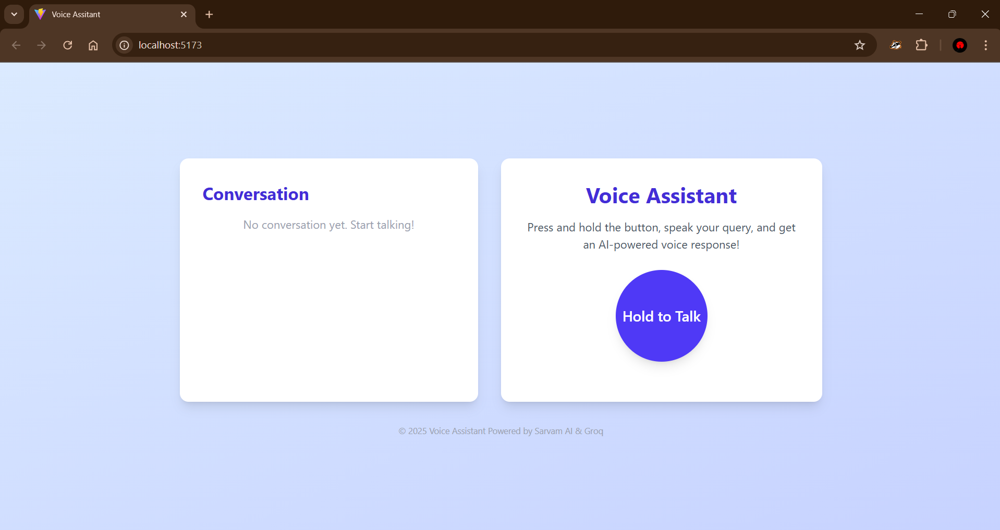

# Voice Assistant

A full-stack voice assistant web app using SarvamAI API for speech-to-text (STT) and text-to-speech (TTS), and Llama-3 from Groq for AI-powered chat. Speak your query, and get an intelligent spoken response!

---

## Demo

### Screenshot


### Video Demo
https://user-images.githubusercontent.com/AditHash/voice-assistant.mp4

<details>
<summary>Click to play video inline (if supported):</summary>

<video src="voice-assistant.mp4" controls width="700"></video>

</details>

---

## Features

- 🎤 **Record Voice**: Press and hold to record your voice in the browser.
- 📝 **Speech-to-Text (STT)**: Converts your speech to text using SarvamAI API.
- 🤖 **AI Chat (Groq Llama-3)**: Sends your transcribed text to Llama-3 for a smart response.
- 🔊 **Text-to-Speech (TTS)**: Converts the AI's response back to speech using SarvamAI API.
- 🌐 **Modern UI**: Clean, responsive React frontend (Vite + Tailwind CSS).
- 🐳 **Dockerized**: Easy to run locally or in Docker (with docker-compose).

---

## Project Structure

```
voice-assistant/
├── backend/      # Flask API for STT, TTS, and chat
│   ├── main.py
│   ├── apimain.py
│   ├── requirements.txt
│   └── ...
├── frontend/     # React (Vite) web app
│   ├── src/
│   │   ├── App.jsx
│   │   └── constant.js
│   └── ...
├── docker-compose.yml
└── README.md
```

---

## Requirements

- Node.js 20+ (for frontend, if running locally)
- Python 3.11+ (for backend, if running locally)
- Docker & Docker Compose (for containerized setup)
- SarvamAI API key (for TTS/STT)
- Groq API key (for Llama-3 chat)

---

## Environment Variables

Create a `.env` file in the `backend/` directory with:

```
GROQ_API_KEY=your_groq_api_key
SARVAM_API_KEY=your_sarvam_api_key
```

---

## Installation & Usage

### 1. Local Development (no Docker)

#### Backend
```bash
cd backend
python3 -m venv venv
source venv/bin/activate
pip install -r requirements.txt
python main.py
```

#### Frontend
```bash
cd frontend
npm install
npm run dev
```

- Open your browser at: [http://localhost:5173](http://localhost:5173)
- The frontend will connect to the backend at `http://localhost:8000` by default.

---

### 2. Dockerized (Recommended)

#### Build & Run
```bash
docker-compose up --build
```
- Frontend: [http://localhost:5173](http://localhost:5173)
- Backend: [http://localhost:8000](http://localhost:8000)

The frontend will automatically use the correct backend URL inside Docker.

---

## API Endpoints

- `POST /voice-chat` (audio): Accepts audio, returns synthesized response audio.
- `POST /chat` (JSON): Accepts `{ request: "text" }`, returns `{ response: "text" }` (see `apimain.py`).
- `POST /tts` (JSON): Accepts `{ text: "..." }`, returns audio.
- `POST /stt` (audio): Accepts audio, returns transcription.

---

## Credits
- [SarvamAI](https://sarvam.ai/) for TTS/STT APIs
- [Groq](https://groq.com/) for Llama-3 API
- [Vite](https://vitejs.dev/) + [React](https://react.dev/) for frontend
- [Flask](https://flask.palletsprojects.com/) for backend

---

## License
MIT